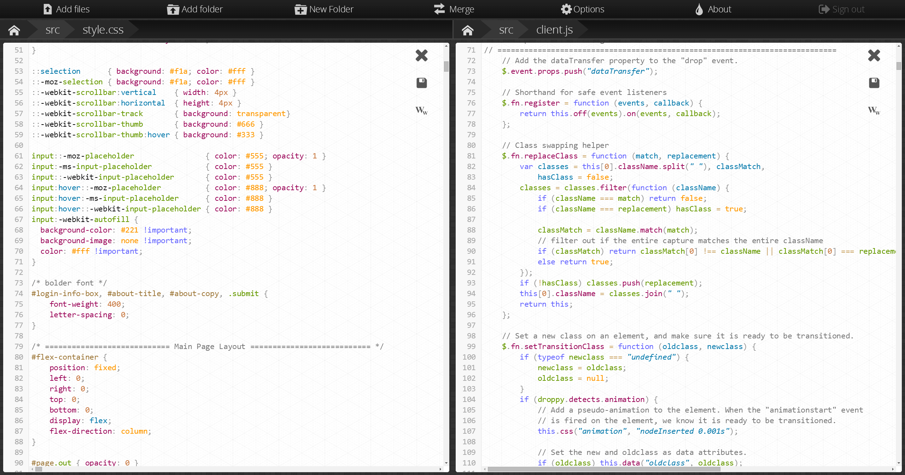

<!--
N.B.: This README was automatically generated by https://github.com/YunoHost/apps/tree/master/tools/README-generator
It shall NOT be edited by hand.
-->

# Droppy for YunoHost

[](https://dash.yunohost.org/appci/app/droppy)  

[](https://install-app.yunohost.org/?app=droppy)

*[Lire ce readme en français.](./README_fr.md)*

> *This package allows you to install Droppy quickly and simply on a YunoHost server.
If you don't have YunoHost, please consult [the guide](https://yunohost.org/#/install) to learn how to install it.*

## Overview

Droppy is a self-hosted file storage server with a web interface and capabilities to edit files and view media directly in the browser.


**Shipped version:** 12.2.0~ynh10

## Screenshots



## :red_circle: Antifeatures

- **Upstream not maintained**: This software is not maintained anymore. Expect it to break down over time, be exposed to unfixed security breaches, etc.

## Documentation and resources

* Upstream app code repository: <https://github.com/silverwind/droppy>
* YunoHost Store: <https://apps.yunohost.org/app/droppy>
* Report a bug: <https://github.com/YunoHost-Apps/droppy_ynh/issues>

## Developer info

Please send your pull request to the [testing branch](https://github.com/YunoHost-Apps/droppy_ynh/tree/testing).

To try the testing branch, please proceed like that.

``` bash
sudo yunohost app install https://github.com/YunoHost-Apps/droppy_ynh/tree/testing --debug
or
sudo yunohost app upgrade droppy -u https://github.com/YunoHost-Apps/droppy_ynh/tree/testing --debug
```

**More info regarding app packaging:** <https://yunohost.org/packaging_apps>
